# Evidencia de Funcionamiento – Bootcamp

Algunas evidencias visuales del correcto despliegue y funcionamiento de la **API Bootcamp ** junto con los servicios de observabilidad utilizados durante la prueba.

Las capturas incluyen comandos ejecutados en consola y verificaciones visuales desde el navegador.

---

## Bootcamp Service (API)

Esta sección muestra la evidencia del despliegue y funcionamiento de la API principal del proyecto.

### 🔹 Servicio corriendo en Minikube
Captura donde se observa el servicio levantado correctamente en el clúster.

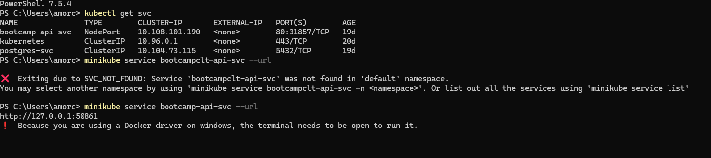

### 🔹 API disponible
Verificación visual desde el navegador confirmando que la API está activa.

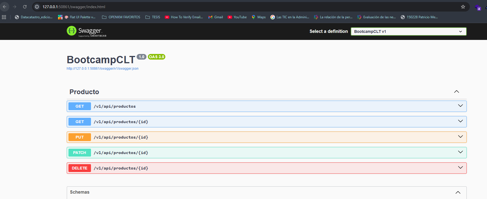

### 🔹 Endpoint funcionando
Ejecución de un endpoint (`GET`) que devuelve la lista esperada de datos.

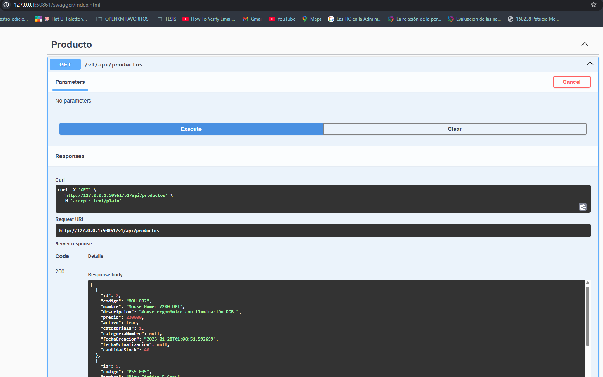

---

## Grafana

Evidencias relacionadas al servicio de **Grafana**, utilizado para visualización de métricas.

### 🔹 Inicio de servicios
Comandos ejecutados en consola para levantar Grafana.

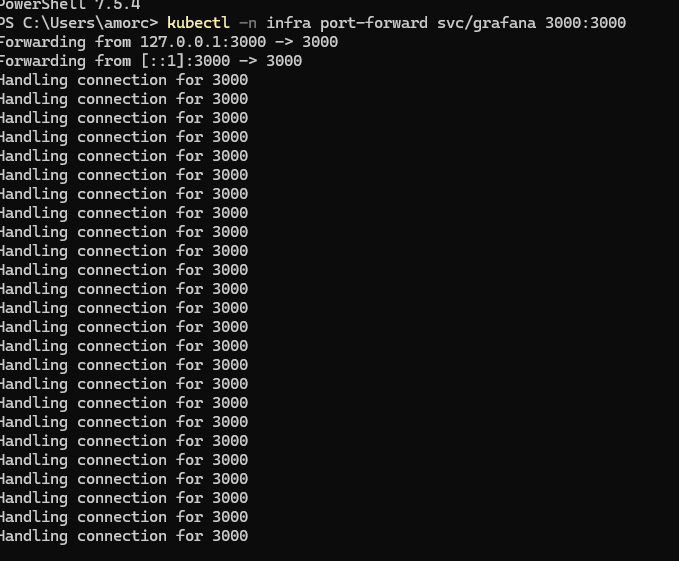

### 🔹 Servicio operativo
Acceso exitoso a la interfaz web de Grafana desde el navegador.

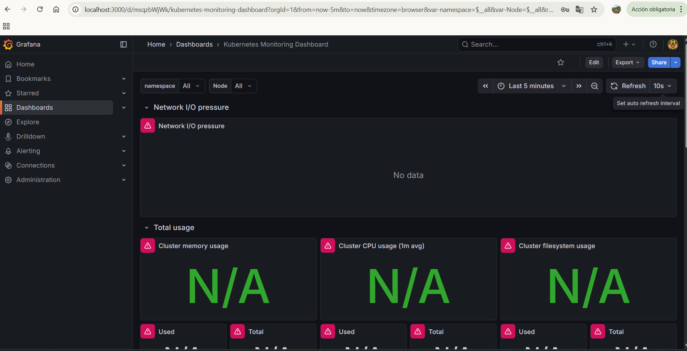

---

## Prometheus

Evidencias del servicio **Prometheus**, encargado de la recolección de métricas.

### 🔹 Inicio de servicios
Ejecución de los comandos necesarios para levantar Prometheus.

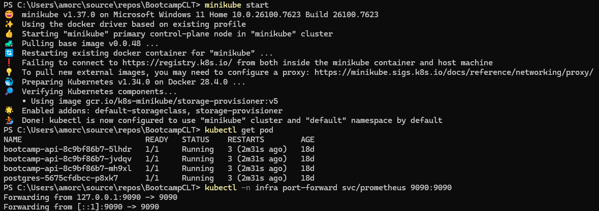

### 🔹 Servicio operativo
Pantalla del navegador mostrando Prometheus funcionando correctamente.

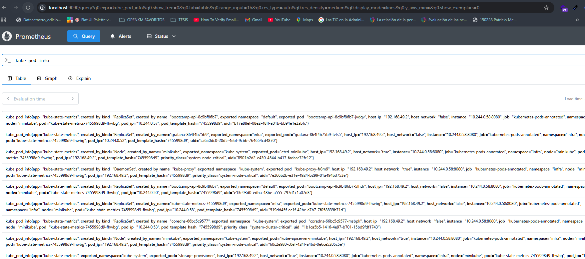

---

## Seq (Logs)

Servicio utilizado para la visualización y análisis de logs de la aplicación.

### 🔹 Visualización de logs
Captura del acceso al panel web de Seq mostrando los logs generados por la aplicación.

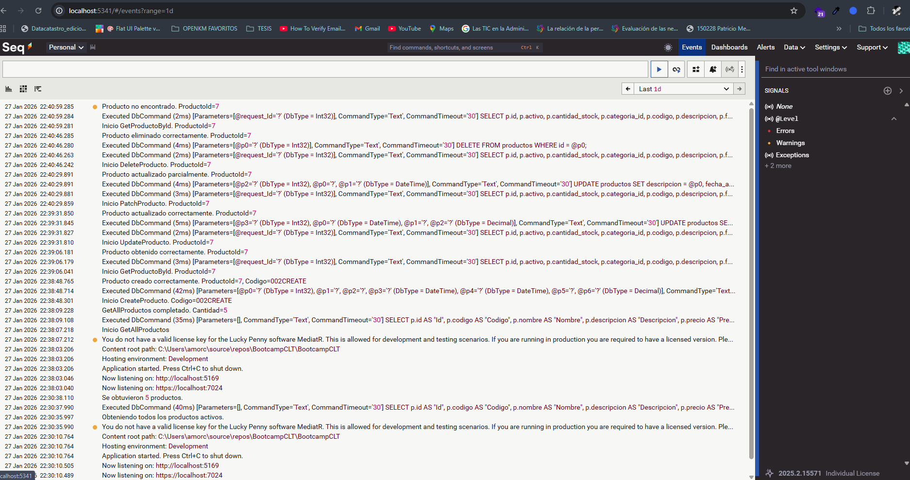

##  CI/CD

Esta sección evidencia el flujo de integración y despliegue continuo (CI/CD) realizado con GitHub Actions, Docker y Helm en Minikube.

### 1️⃣ Configuración del Runner en Windows
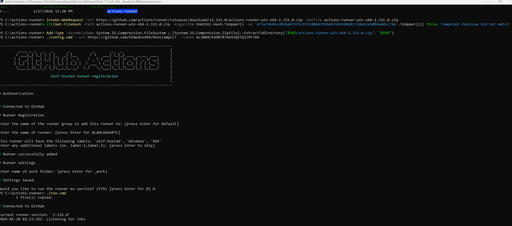

### 2️⃣ Runner registrado en GitHub

### 3️⃣ Estado del Pod antes del commit
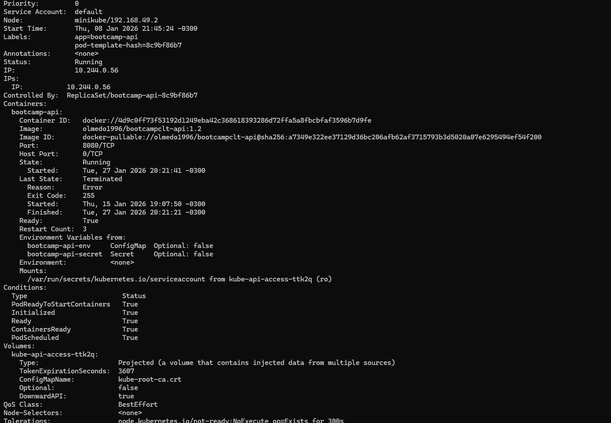

### 4️⃣ Commit ejecutándose en Actions
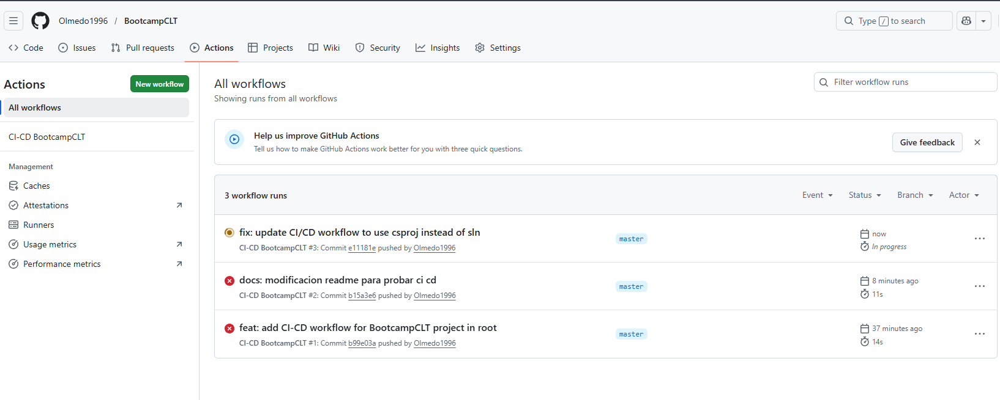

### 5️⃣ CI/CD completado con éxito
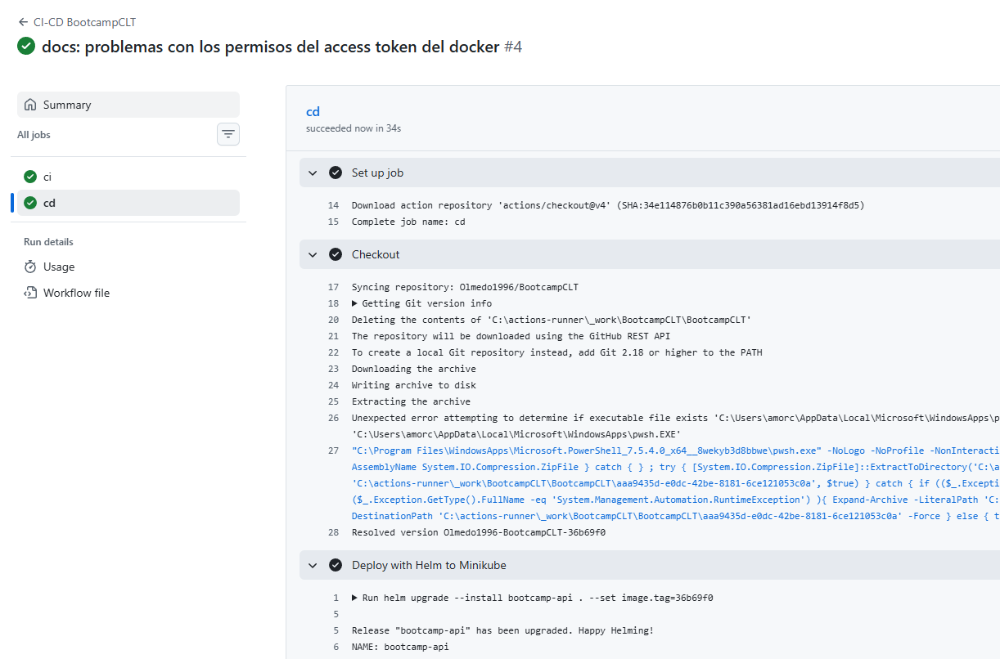

### 6️⃣ Estado del Pod con el tag aplicado
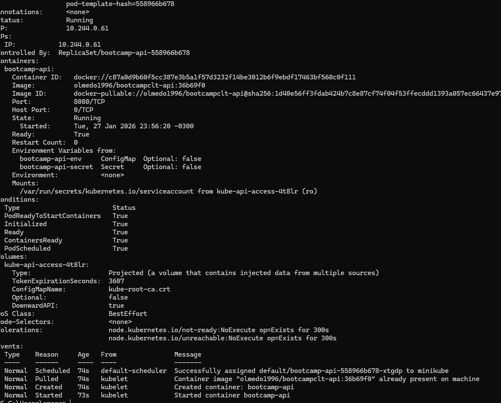